# AdventureWorksCompany-PowerBI-Dashboard 

## Introduction

Andrian Wijaya, a data analyst learner completing the Maven Analytics course "[Microsoft Power BI Desktop for Business Intelligence](https://www.udemy.com/course/microsoft-power-bi-up-running-with-power-bi-desktop/).", developed this project as a hands on application of the skills acquired throughout the course. Using the Adventure Works Bike Shop dataset (2020–2022), the project simulates a real-world business intelligence scenario for a cycling retailer operating across three continents Europe, North America, and Pacific.

However, operating a multi continent retail business comes with its own challenges, including tracking revenue performance across product categories, understanding customer demographics and behavior, and monitoring product-level performance against targets.

Analyzing sales data is essential for uncovering growth patterns, identifying high value customer segments, and making data driven decisions. This project leverages **Power BI** to analyze Adventure Works' sales, customer, and product data providing actionable insights into revenue trends, product profitability, and customer 
segmentation. The analysis ultimately aims to support strategic decisions through evidence-backed findings and recommendations.

---

## Table of Content
📁 1. [Problem Statement](#1-problem-statement)  

📁 2. [Skills Demonstrated](#2-skills-demonstrated)  

📁 3. [Data Sourcing](#3-data-sourcing)  

📁 4. [Data Transformation](#4-data-transformation)  

📁 5. [Data Modeling](#5-data-modeling)  

📁 6. [Data Visualization](#6-data-visualization)

📁 7. [Data Analysis](#7-data-analysis)  

📁 8. [Conclusions](#8-conclusions)  

📁 9. [Recommendations](#9-recommendations)  

---
## 1. Problem Statement
Adventure Works Bike Shop needed a centralized view of their business performance across sales, customers, and products. The goal was to build an interactive dashboard that enables data-driven decisions by tracking revenue, profit, orders, return rates, and customer behavior over a 2.5-year period (Jan 2020 – Jun 2022).
1. What is the total revenue, profit, and order volume for the business?
2. Which product categories and products drive the most orders and revenue?
3. How is monthly revenue and return rate trending over time?
4. How many unique customers does Adventure Works have and what is the average revenue per customer?
5. Which occupation and income segments place the most orders?
6. Who are the top revenue-generating customers and what are their profiles?
7. How is each product performing against its monthly orders, revenue, and profit targets?
8. Which products have the highest return rates and is it above or below the company average?
9. How is product profit trending over time and is it consistently hitting targets?

---

## 2. **Skills Demonstrated**
- **Data Transformation**  
  - **Power Query** — Using Power Query to clean, transform, and shape raw data into an analysis-ready format, ensuring accuracy and consistency.
  - **DAX** — custom measures for KPIs, dynamic labels, conditional logic, and time intelligence (DATEADD, DATESMTD)
- **Data Modeling** — star schema design with fact and dimension tables
- **Data Visualization** — KPI cards, gauge charts, line charts, donut charts, and matrix tables
- **Conditional Formatting** — dynamic colors based on performance vs target
- **UX Design** — consistent color theme, layout hierarchy, and slicer interactions

---

## 3. **Data Sourcing**
The dataset is based on the AdventureWorks sample database provided by Microsoft. It consists of 8 tables:

| Table | Description |
|---|---|
| Sales Data | Transaction-level fact table |
| Return Data | Return transaction-level fact table |
| Customer Lookup | Customer demographics and attributes |
| Product Lookup | Product names, categories, and pricing |
| Product Categories | Product category hierarchy |
| Product Subcategories | Product subcategory hierarchy |
| Territory Lookup | Sales region and continent |
| Calendar Lookup | Date dimension table |

---

## 4. **Data Transformation**  
Data was **cleaned** and transformed using Power Query (M Language):
- Removed duplicate and null rows from all Data
  - 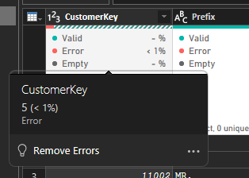
- Standardized date formats across all tables and creating column for every date element
  - 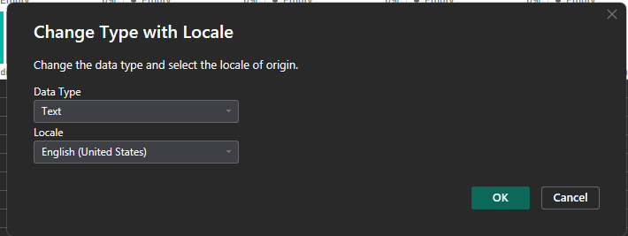
  - 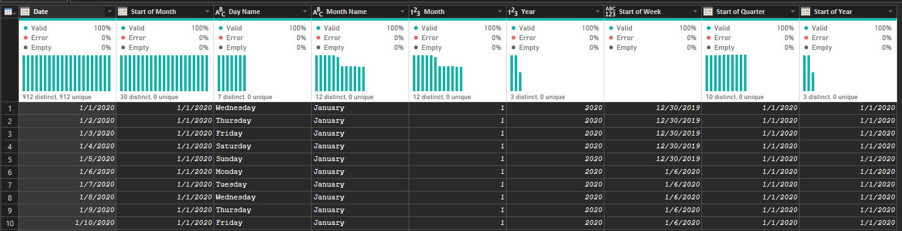
- Created calculated column
  - 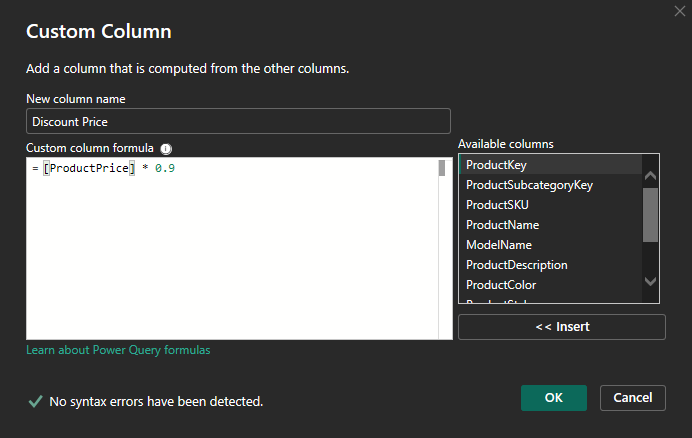
- Filtered irrelevant columns to reduce model size and improve performance
  - 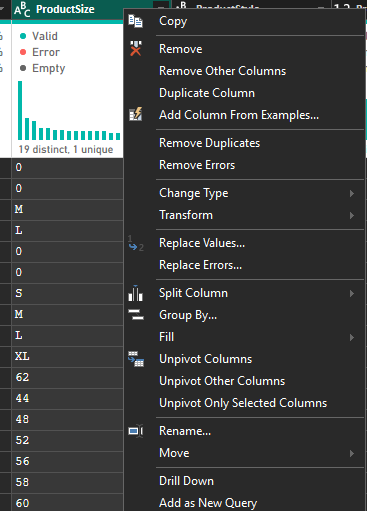
- Custom Calculation (DAX Measure)
  - Page 1: **Executive Dashboard**
    - 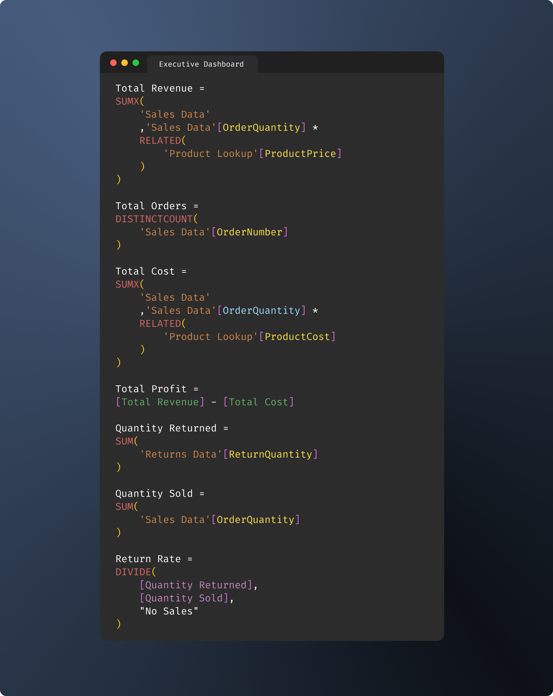
      ---
  - Page 2: **Product Detail Dashboard**
    - 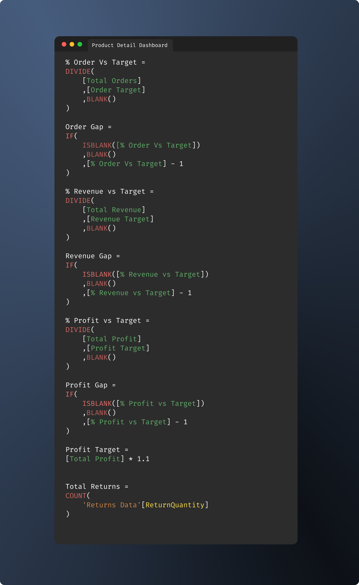
      ---
  - Page 3: **Customer Detail Dashboard**
    - 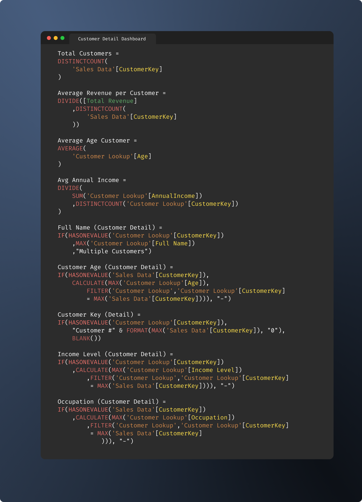

---

## 5. **Data Modeling**
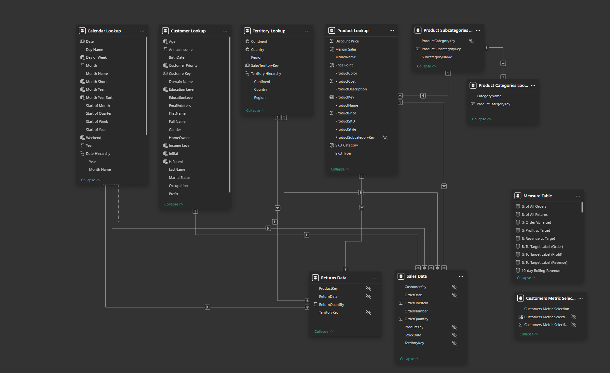
- **Fact Table**: Sales Data (transactions), Return Data (transaction)
- **Dimension Tables**: Customer, Product, Territory, Calendar, Category Product, and Subcategory Product
- All relationships are **single-direction** (one-to-many)
- A dedicated **measure table** (`Measures`) stores all DAX calculations separately from raw data tables
- No bi-directional relationships to maintain query performance

---

## 6. **Data Visualization**  

The dashboard consists of 3 report pages:
- **Executive Summary**
  ---
  - 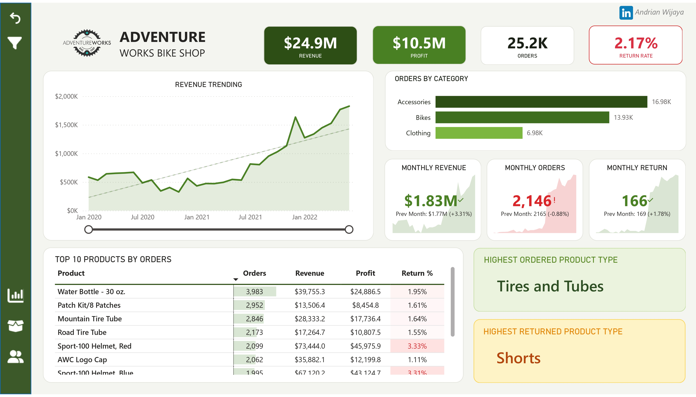
- **Product Detail**
  ---
  - 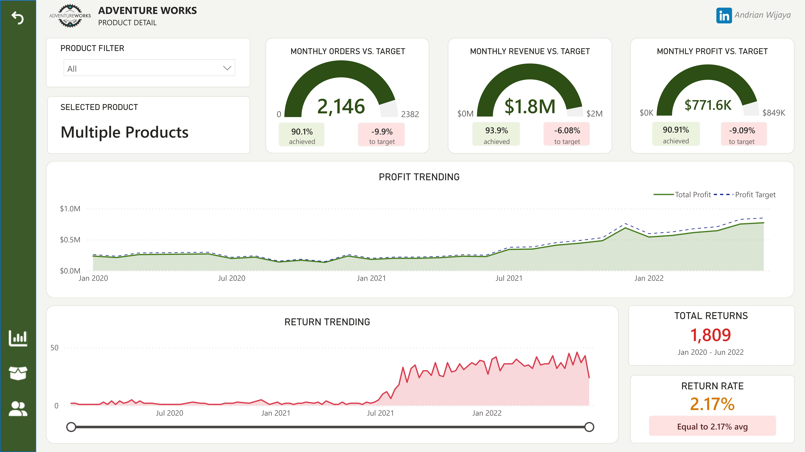
- **Customer Detail**
  ---
  - 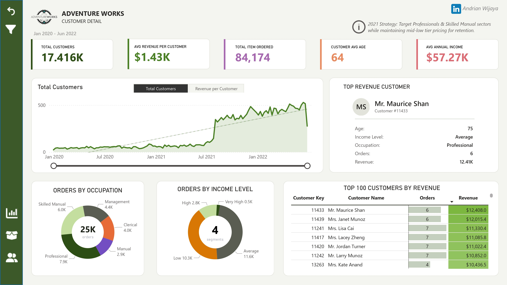

---

## 7. Data Analysis

### A. Overall Sales Trend

Adventure Works revenue grew consistently from January 2020 through
June 2022. Based on monthly data:

**Year-over-Year Revenue Growth:**
| Year | Total Revenue | Growth |
|---|---|---|
| 2020 | $5.4M | Baseline |
| 2021 | $9.7M | +79.6% vs 2020 |
| 2022 (Jan–Jun) | $9.2M | On pace to exceed 2021 full year |

The most significant growth occurred in the first half of 2022,
where every month (Jan–Jun) consistently outperformed the same
month in the previous year averaging 2–3x growth. January 2022
($1.27M) grew **194%** compared to January 2021 ($432K), and June 2022
($1.83M) grew **242%** compared to June 2021 ($534K).

**November 2021 Revenue Dip:**
The revenue decline in November 2021 was driven by a sharp drop in
bike transactions **only 191 bike purchases** were recorded that month.
Given that Bikes is the most profitable category, reduced bike
transactions had a significant impact on total monthly revenue,
despite the absolute figure ($1.13M) still being higher than most
months in 2020. This suggests a seasonal pattern in bike sales
toward year-end.

> [!IMPORTANT]
**Data Cutoff:**
Data ends on **June 30, 2022**. The customer decline visible at the end
of the trend chart is not an indication of churn — it reflects the
end boundary of the available dataset.

---

### B. Product Performance

**Profit by Category:**
| Category | Profit | Orders | Profit per Order |
|---|---|---|---|
| Bikes | $2.9M | 13,929 | ~$208 |
| Accessories | $112.8K | 16,983 | ~$6.6 |
| Clothing | $31.6K | 6,976 | ~$4.5 |

Although Accessories leads in transaction volume (16,983 orders
67% more than Bikes), **the Bikes category generates 25x more profit
than Accessories**. This highlights a critical insight: a strategy
focused purely on sales volume without considering margin can be
misleading for business decision-making.

The top-performing product in the Bikes category is the
**Mountain-200**, which is the highest profit contributor across
all continents Europe, North America, and Pacific.

**Return Rate by Continent:**
| Continent | Return Rate |
|---|---|
| Pacific | 2.25% — highest |
| Europe | 2.17% |
| North America | 2.14% — lowest |

The overall return rate of 2.17% remains within an acceptable retail
threshold (below 5%). However, Pacific warrants closer attention 
particularly for the **Vests** product type, which records the highest
return rate in that region. This may indicate a size mismatch or
differing quality expectations in the Pacific market.

**Top Products per Continent (by Quantity Sold):**
| Continent | #1 | #2 | #3 |
|---|---|---|---|
| Europe | Water Bottle | Road Tire Tube | AWC Logo Cap |
| North America | Water Bottle | Mountain Tire Tube | Patch Kit/8 Patches |
| Pacific | Water Bottle | Patch Kit/8 Patches | Road Bottle Cage |

**Water Bottle - 30 oz**. dominates as the **best-selling product** across
all continents, demonstrating universal and consistent demand across
all markets. Beyond Water Bottle, product preferences vary
significantly by continent — indicating the need for localized
inventory and promotional strategies per region.

---

### C. Most & Least Popular Products

| Rank | Product | Category | Orders |
|---|---|---|---|
| 1st | Water Bottle - 30 oz. | Accessories | 3,983 |
| 2nd | Patch Kit/8 Patches | Accessories | 2,952 |
| Last | Mountain-100 Silver, 48 | Bikes | 22 |

High sales volume does not necessarily reflect high profitability.
Water Bottle - 30 oz. leads in volume with 3,983 transactions,
but its margin per unit is significantly smaller than Bikes products.
Mountain-100 Silver, 48 with only 22 transactions likely
generates far higher revenue per transaction given the substantial
price difference between Bikes and Accessories.

---

### D. Customer Detail

Adventure Works served **17,416 unique customers** (comprising both
repeat buyers and new customers) throughout January 2020 – June 2022,
with an average customer age of **64 years** a mature, physically
active segment with stable purchasing power.

**Orders by Occupation:**
| Occupation | Orders | Share |
|---|---|---|
| Professional | 7,900 | 31.6% |
| Skilled Manual | 5,900 | 23.6% |
| Management | 4,400 | 17.6% |
| Clerical | 3,900 | 15.6% |
| Manual | 2,900 | 11.6% |

Professional and Skilled Manual together account for **55.2%** of
all transactions confirming that active working-age to mature
professionals represent the core market for Adventure Works.

**Orders by Income Level:**
86.9% of all transactions totaling 73,041 items sold came from
the Average and **Low Income segments**. This confirms that while
Adventure Works carries premium products (Bikes), the majority of
its **customers are middle-to-low income buyers** who tend to purchase
more affordable Accessories products.

**Top Customer:**
Mr. Maurice Shan (age 75, Professional, Average Income) generated
the highest revenue at $12,408 across 6 transactions averaging
$2,068 per transaction, approximately **1.45x above** the overall
customer average of $1,431. This demonstrates that the senior
Professional segment holds strong spending potential despite not
having the highest transaction frequency.

---

## 8. Conclusions

### Revenue & Growth
Adventure Works recorded strong and consistent revenue growth
throughout January 2020 – June 2022. Total revenue grew from $5.4M
(2020) to $9.7M (2021), and the first half of 2022 alone already
reached $9.2M indicating that full year 2022 could **potentially
exceed $18M** if the trend continues. This growth was primarily driven
by the expansion of the Accessories product line and the steady
performance of Bikes as the most profitable category.

### Product Profitability
The most significant finding from this analysis is the profitability
gap between Bikes and Accessories. Despite Accessories leading in
volume with 16,983 orders, Bikes generated $2.9M in profit
25x more than Accessories ($112.8K). This confirms that sales volume
alone is not a reliable indicator of business health — margin and
product mix are far more deterministic.

### Product Returns
The overall return rate of 2.17% remains within acceptable limits.
However, distribution is uneven: Pacific records the highest return
rate (2.25%) particularly for Vests, while Shorts is the most
returned product type across Europe and North America. Water Bottle -
30 oz., despite being the top-selling product across all continents,
also records the highest absolute returns within Accessories this
warrants ongoing monitoring.

### Customer Profile
Adventure Works core market consists of **middle-to-low income**,
**mature-aged customers** (average age 64), predominantly from the
**Professional and Skilled Manual occupation** segments, which together
contribute 55.2% of total transactions. The fact that 86.9% of
transactions come from Average and Low Income segments indicates
that Adventure Works has successfully positioned itself as an
accessible brand though this also reveals **limited penetration**
into higher-spending segments.

### Market Distribution
Water Bottle - 30 oz. is the only product that consistently ranks
as the top seller across all three continents signaling reliable
universal demand. Beyond this product, continental preferences
diverge considerably, suggesting that a one-size-fits-all approach
to inventory and promotions is suboptimal.

---

## 9. Recommendations

### 1) Prioritize Bike Sales to Drive Profitability
Given that Bikes generate 25x more profit than Accessories per
category, an upselling strategy from Accessories to Bikes should
be strengthened. Customers who frequently purchase Accessories
particularly Tires and Tubes and Patch Kits are ideal candidates
to be introduced to entry-level Bikes such as the Mountain-200.

**Action:** Develop **bundle promotions** where the purchase of select
accessories includes a discount on entry-level Bike products to
drive category upgrades.

---

### 2) Localize Strategy by Continent
Differences in product preferences and return rates across continents
indicate that localized marketing and inventory strategies will
deliver better results than a unified global approach:

| Continent | Focus Product | Recommended Action |
|---|---|---|
| Europe | Road Tire Tube, AWC Logo Cap | Strengthen road cycling accessories stock |
| North America | Mountain Tire Tube, Patch Kit | Focus on mountain biking segment |
| Pacific | Road Bottle Cage, Patch Kit | Develop road cycling segment |
| Pacific | Vests (high returns) | Quality review & size guide improvement |

---

### 3) Quality Control for High-Return Products
Shorts (highest return type in Europe & North America) and Vests
(highest return type in Pacific) should be prioritized for **quality
review**. Recommended steps:
- Improve size guides on product pages to reduce fit related returns.
- Add customer review sections to help prospective buyers set
  accurate expectations.
- Conduct pre-shipment quality sampling for continents with the
  highest return rates, particularly Pacific (2.25%).

---

### 4) Sustain Water Bottle Momentum
Water Bottle - 30 oz. is the most universally demanded product and
recorded 2x growth in the first half of 2022. Despite having the
highest absolute returns in Accessories, its return rate remains
within acceptable bounds. This product serves as a critical
traffic driver across all markets.

**Action:** Position Water Bottle as the anchor product in
cross-continent marketing campaigns, and consider **bundling it**
with complementary Accessories to increase average order value.

---

### 5) Retention Strategy for the Professional Segment
The Professional segment contributes 31.6% of all transactions and
demonstrates higher spending per transaction as evidenced by
top customer Mr. Maurice Shan at $2,068 per transaction versus the
$1,431 customer average. This segment is the most valuable to retain.

**Action:**
- Implement a loyalty program targeting repeat buyers.
- Offer early access to new products for top-spending customers.
- Introduce membership tiers based on cumulative spending to
  incentivize higher transaction frequency.

---

### 6) Address November Seasonality
The sharp drop in bike transactions during November 2021 (only 191
transactions) suggests a recurring seasonal pattern toward year-end.
If this repeats annually, management should proactively prepare by:
- Running end-of-year promotions specifically for the Bikes category
  to counteract the seasonal slowdown.
- Shifting marketing focus to Accessories and Clothing during
  low-season months to maintain revenue stability.

---

### 7) Expand into Higher Income Segments
With 86.9% of customers coming from Average and Low Income brackets,
Adventure Works has significant headroom to grow its presence among
High and Very High Income segments (currently only 13.1%) who
carry higher revenue-per-transaction potential.

**Action:**
- Strengthen the premium product lineup (high-end Bikes and Clothing)
- Develop more aspirational marketing communication targeting
  higher income demographics
- Explore partnerships with premium cycling communities in
  Europe and North America to build brand presence in
  higher-spending segments

---

### Repository Contents
 - Power BI Dashboard File: The main PBIX File containing the analysis and visualizations.
 - Data Sources: Raw Dataset used in the project.
 - Screenshots/Reports: Exported visualizations for sharing insights.
 - README.md: Project documentation (this file)

---
_Source of Curriculum and Dataset: Maven Analytics_
